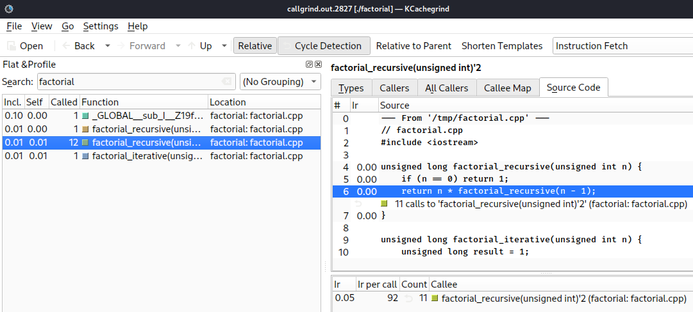

# Callgrind

Callgrind, a part of the Valgrind framework, is a profiling tool that records the call history, number of instructions executed, cache utilization, and branch prediction data of an executed program.

Callgrind extends the functionality of Cachegrind by adding detailed call graphs, making it useful for understanding the flow of execution and identifying bottlenecks. Callgrind's output can be analyzed with tools like KCachegrind or QCachegrind to visualize a program's performance metrics.

## Example

### C++ source code
```cpp
unsigned long factorial_recursive(unsigned int n) {
    if (n == 0) return 1;
    return n * factorial_recursive(n - 1);
}

unsigned long factorial_iterative(unsigned int n) {
    unsigned long result = 1;
    for (unsigned int i = 1; i <= n; ++i) {
        result *= i;
    }
    return result;
}

int main() {
    unsigned number = 12; // Example number
    cout << "Recursive factorial of " << number << " is " << factorial_recursive(number) << endl;
    cout << "Iterative factorial of " << number << " is " << factorial_iterative(number) << endl;
    return 0;
}
```

### Running Callgrind
```bash
g++ -g -o factorial factorial.cpp
valgrind --tool=callgrind ./factorial
```

### Visualizing with KCachegrind
KCachegrind is a UI used for analyzing Callgrind results.
```bash
$ kcachegrind callgrind.out.XXXX
```


