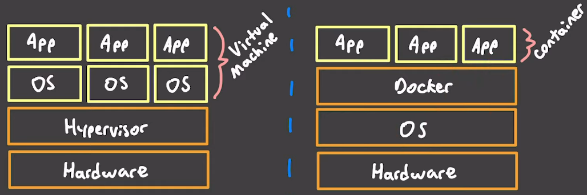

# Docker

*https://en.wikipedia.org/wiki/Docker_(software)*

Docker uses OS-level virtualization to deliver software in packages called *containers*. Docker helps automate the deployment of applications in lightweight containers so that applications work consistently on different systems.

## Containers
Docker containers encapsulate an application with all of its dependencies and libraries, making it portable and consistent across different environments. This ensures that the application works consistently despite differences in OS and underlying infrastructure.

Containers are lightweight, making them more efficient and faster than traditional virtual machines because they share the host system's kernel and do not require the overhead of associating an operating system with each application.

## Architecture


*Image: https://youtu.be/NPguawVjbN0*

Docker containers are applications which reuse the OS, while VMs package the entire OS. This makes containers faster to start and smaller in size.

## Key Features
**Portability**: Once a Docker container is created, it can be run on any system that has Docker installed. This reduces the "it works on my machine" problem in development.

**Efficiency**: Containers share the host system's kernel, not requiring an OS per application. They start quickly and use less CPU and RAM.

**Isolation**: Docker ensures that applications that are running in containers are isolated from each other and from the host system. This isolation improves security and allows for fine-grained control over system resources.

**Developer Productivity**: Docker containers support a fast development cycle since developers can work in local containers that mirror the production environment.

## How Docker Works
**Docker Images**: An image is a lightweight, standalone, executable package that includes everything needed to run a piece of software, including the code, runtime, libraries, environment variables, and config files.

**Docker Containers**: A container is a runtime instance of a Docker image. It runs isolated from the host environment by default, only accessing host files and networks if configured to do so.

## Dockerfile
A `Dockerfile` is a text file that contains all the commands a user would otherwise call on the command line to assemble an image.

Example `Dockerfile`:
```bash
# Use the official Ubuntu as a parent image.
# 'FROM' is typically the first line in a Dockerfile.
FROM ubuntu:latest

# change the working directory. Subsequent statements
# which use relative paths will start from here.
WORKDIR /app

# RUN runs a command inside the image being built.
# RUN is commonly used to install and configure packages
RUN apt-get update && apt-get install -y python3

# COPY adds files and folders to your image's file system
COPY main.js /app/main.js

# ENV sets environment variables available to containers
ENV PATH=$PATH:/app/bin
```

## API

### Version
```shell
$ docker version
Client:
 Cloud integration: v1.0.35+desktop.13
 Version:           26.0.0
```

### Information about Docker installation
```shell
$ docker info
Client:
 Version:    26.0.0
 Context:    default
 Debug Mode: false
 Plugins: ...
```

### List containers
```shell
# all containers
$ docker ps -a

# currently running containers
$ docker ps
```

### List images
```shell
$ docker images
REPOSITORY          TAG       IMAGE ID       CREATED        SIZE
ubuntu              latest    4e2e4f88cac     3 days ago     64.2MB
nginx               1.19      9beeba2410e     2 weeks ago    133MB
```

### Build image from Dockerfile then run the image
First, create a Dockerfile. Assume it is called `my-python-image`.

Next, build the image:
```shell
$ docker build -t my-python-image .

# output:
Successfully built 123456789abc
Successfully tagged my-python-image:latest
```

- `-t` is optional and used to set the image tag.

Lastly, run the container:
```shell
$ docker run -it my-python-image
```

`-it` means open in Interactive Terminal

### Run image
More complex example than above:
```shell
$ docker run --name my-nginx -d -p 8080:80 nginx
```

- `--name my-nginx` assigns the name my-nginx to the container.
- `-d` runs the container in detached mode, so it runs in the background.
- `-p 8080:80` maps port 80 of the container to port 8080 on the host, allowing you to access the Nginx server by visiting http://localhost:8080 in your web browser.
- `nginx` is the name of the image to use, with Docker pulling the latest version of the Nginx image from Docker Hub if it's not already present locally.

### Stop running a Docker container
Use the `stop` command.
`$ docker container stop my_container`

Use `docker container ps -a` to check on its status.

## Resources
- https://spacelift.io/blog/dockerfile
