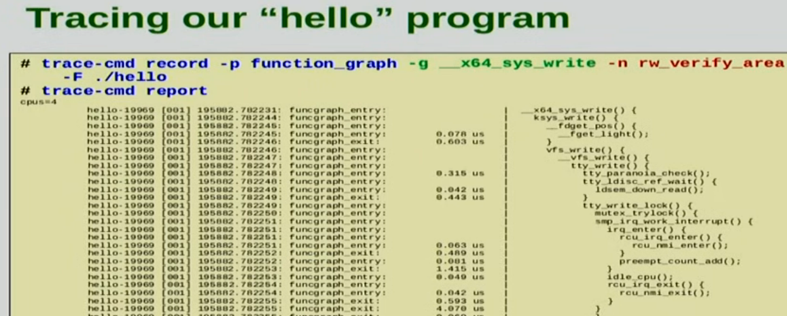

# ftrace

ftrace (Function Tracer) is a tracing framework for the Linux kernel. It allows developers and system administrators to analyze and debug what's happening inside the kernel at runtime. ftrace can trace almost every function in the kernel, making valuable for performance analysis, debugging, and understanding kernel behavior.



*Image: https://youtu.be/JRyrhsx-L5Y*

## Things `ftrace` shows that `strace` does not
- Page faults: `__do_page_fault()`
- System calls: `do_syscall_64()`
- Interrupts

## Function Graph Tracer
This mode allows you to see the graph of function calls that happen within the kernel. It's useful for understanding the flow of execution through different functions.

```bash
echo function_graph > /sys/kernel/debug/tracing/current_tracer
echo 1 > /sys/kernel/debug/tracing/tracing_on
# execute commands to trace
echo 0 > /sys/kernel/debug/tracing/tracing_on
cat /sys/kernel/debug/tracing/trace
```

## Function Tracer
The function tracer tracks when functions are entered and exited in the kernel. This can help identify which functions are being called and how often.

```bash
echo function > /sys/kernel/debug/tracing/current_tracer
echo 1 > /sys/kernel/debug/tracing/tracing_on
# execute commands to trace
echo 0 > /sys/kernel/debug/tracing/tracing_on
cat /sys/kernel/debug/tracing/trace
```

## Event Tracing
ftrace can also trace specific kernel events, such as scheduler events, interrupts, block IOs, and network packets, providing detailed insights into kernel activities.

```bash
echo 1 > /sys/kernel/debug/tracing/events/sched/sched_switch/enable
echo 1 > /sys/kernel/debug/tracing/tracing_on
# execute commands to trace
echo 0 > /sys/kernel/debug/tracing/tracing_on
cat /sys/kernel/debug/tracing/trace
```

## Tracing Syscalls
Syscall tracing is useful for understanding the system calls made by a process and useful for debugging and performance analysis.

```bash
echo syscalls > /sys/kernel/debug/tracing/current_tracer
echo 1 > /sys/kernel/debug/tracing/tracing_on
# run application or command
echo 0 > /sys/kernel/debug/tracing/tracing_on
cat /sys/kernel/debug/tracing/trace
```

## Dynamic Tracing with `kprobe`/`uprobe`
ftrace supports dynamic tracing of kernel functions and user-space applications using kprobes and uprobes. This is useful when you need to trace a function that is not statically defined as a trace point.

```bash
# for kernel function
echo 'p:my_probe do_fork' > /sys/kernel/debug/tracing/kprobe_events
echo 1 > /sys/kernel/debug/tracing/events/kprobes/my_probe/enable

# for user-space function
echo 'p:my_uprobe /path/to/binary:0x12345' > /sys/kernel/debug/tracing/uprobe_events
echo 1 > /sys/kernel/debug/tracing/events/uprobes/my_uprobe/enable
```

## trace-cmd
An easier approach to using `ftrace`.
```bash
root> trace-cmd start -p function
root> trace-cmd show

root> trace-cmd record -e syscalls -F <program>
root> trace-cmd report
```

## Usage Tips
- Always check the contents of `/sys/kernel/debug/tracing/available_tracers` to see which tracers are available on your system.
- You may need root privileges or specific capabilities to access ftrace functionality.
- Be cautious with tracing in production environments as it can impact system performance.
