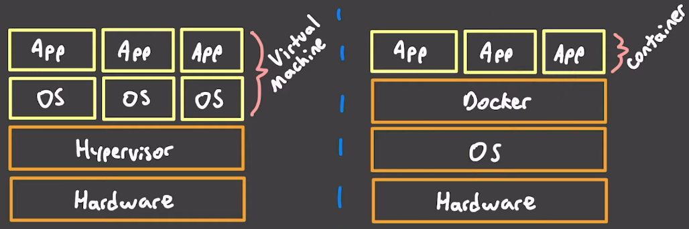

# Markdown

Tips and trips for the markdown markup language.

## Headings
- Use `#` for a size 1 (large) heading
- Use `##` for size 2 heading
- Use `###` for size 3 heading
- Use `####` for size 4 heading
- Use `#####` for size 5 (small) heading

## Formatting
- Use `*` for *italics*
- Use `**` for **bold**
- Use `***` for ***bold and italics***
- Use `~~` for ~~strikethrough~~

Standard markdown does not support <u>underline</u>.

Standard markdown does not support <mark>highlight</mark>.

## Lists

### Unordered list
Use `-` to create unordered list.

- Item 1
- Item 2
    - Sub-item for Item 2

### Ordered list
Lists can be numbered sequentially, ex: 1, 2, 3, ..., or all the same, ex: 1, 1, 1. Numbering everything as `1` allows adding, removing, and deleting entries without needing to renumber anything.

Example:
1. First item
1. Second item
    1. Sub-numbered item one
    1. Sub-numbered item two
1. Third item

## Links

### Hyperlinks
```
[example web page](https://www.example.com)
```

### URL or Email address
Enclose in angle brackets.
```
<https://www.example.com/>

<user@example.com>
```

Markup example:

<https://www.example.com/>

<user@example.com>

### Links to sections in documents (internal link)
```
[Resources section](#resources)
```

### Images
```

```

## Tables

Use `:` in separator row to control alignment.
- No `:`: left align (default)
- Right `:`: right align
- Left and right `:`: center

| Example table col | Column with long name | Another wide column |
|-------------------|----------------------:|:-------------------:|
| Left align 1      | Right align 1         | Center 1            |
| Left align 4      | Right align 2         | Center 2            |

## Code
Use backticks to create a `code fragment`.

### Code blocks
```
basic code block no language
```

```bash
# code block with language (bash) for syntax coloring
echo 'hello world!'
```

## Block quotes
To create a block quote, add `>` in front of a paragraph. Use `>` by itself to separate block paragraphs.

> This paragraph is a block quote.
>
> The empty line above creates a new paragraph.

## Resources
- https://www.markdownguide.org/basic-syntax/
- https://www.codecademy.com/resources/docs/markdown
