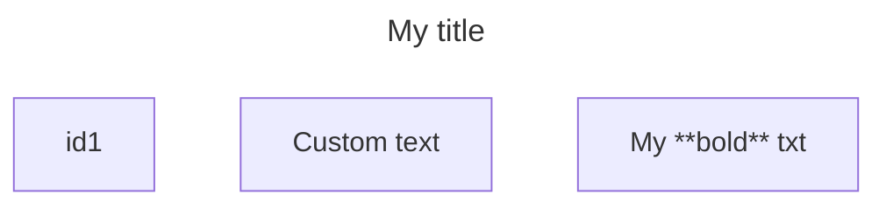
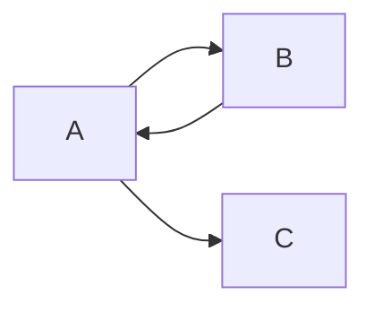
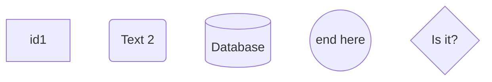
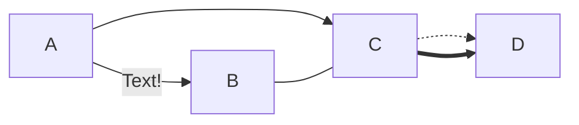
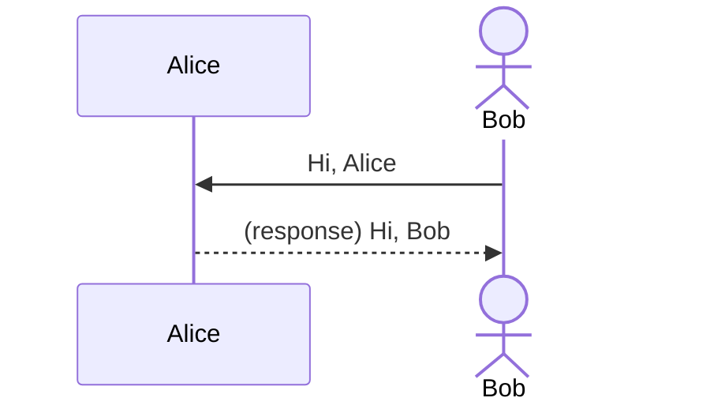
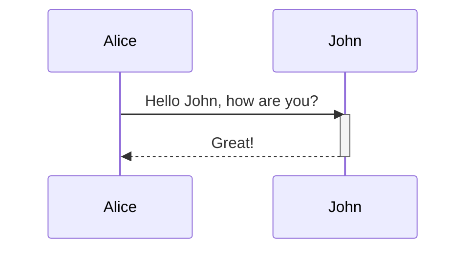

# mermaid

Mermaid is an open-source JavaScript-based diagramming and charting software that generates diagrams from text-based descriptions.

See also: [Markdown](markdown.md)

## Common syntax
- `%%`: begin comment line
- `title:`: custom title (between `---` and `---` lines)
    - Note: title must come before comments

## Flowcharts
Flowcharts are composed of nodes and edges.





### Node shapes



### Links



#### Animation


## Sequence diagrams

### Participants
Participants are rendered in order of appearance. Use `participant` for a rectangle, and `actor` for a stick figure.



### Messages
Messages are lines and use this syntax: `[Actor][Arrow][Actor]:Message text`

- `->`: solid line without arrow
- `-->`: dotted line without arrow
- `->>`: solid line with arrow
- `-->>`: dotted line with arrow (commonly used for responses)

### Activations
*Activations* in sequence diagrams show how long a participant is actively processing a request. They are rendered as a thin rectangle on the participant's lifeline.



#### Shortcut notation
Activations have their own shortcut: `+[Actor]`, and `-[Actor]`.

This diagram is identical to above.
```
sequenceDiagram
    Alice->>+John: Hello John, how are you?
    John-->>-Alice: Great!
```

## Resources
- https://mermaid.ai/open-source/intro/
