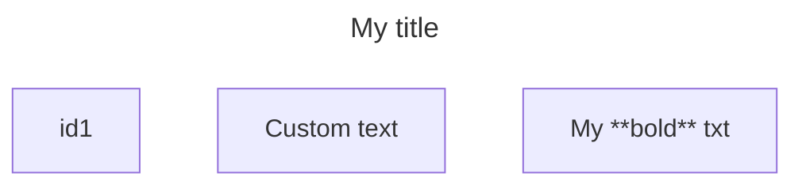
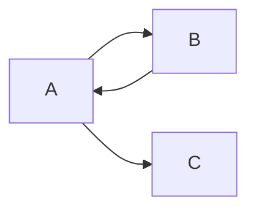
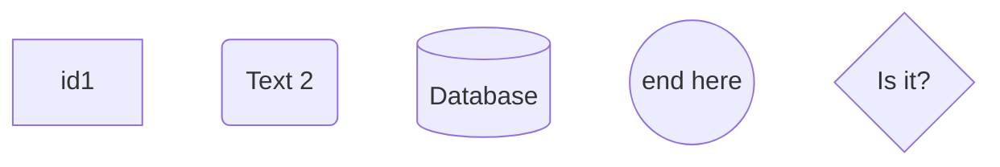
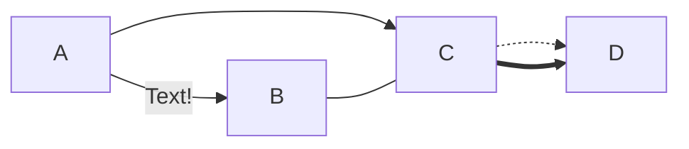
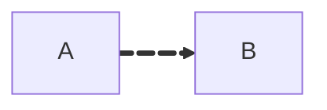

# mermaid

Mermaid is an open-source JavaScript-based diagramming and charting software that generates diagrams from text-based descriptions.

See also: [Markdown](markdown.md)

## Common syntax
- `%%`: begin comment line
- `title:`: custom title (between `---` and `---` lines)
    - Note: title must come before comments

## Flowcharts
Flowcharts are composed of nodes and edges.

### Node shapes

### Links

#### Animation

## Resources
- https://mermaid.ai/open-source/intro/
